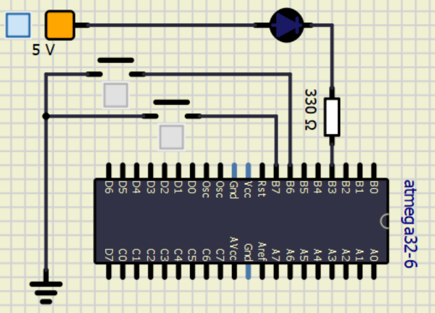
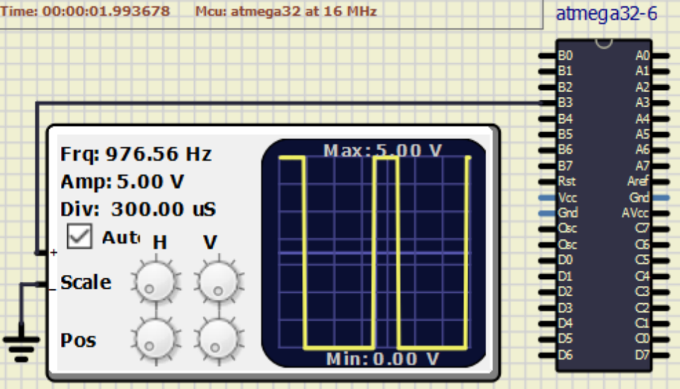
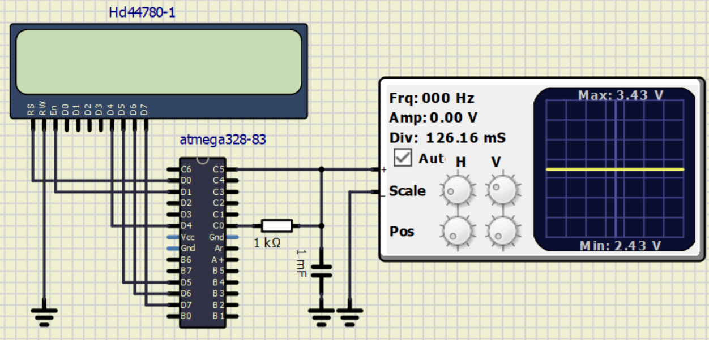
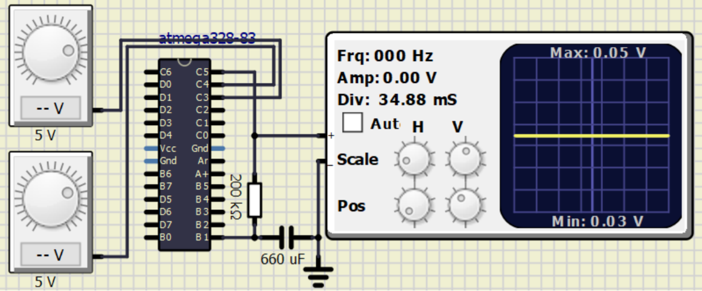

# ...

## Wymagane

## Opis przykładów

### Przykład 1. - Sterowanie jasnością didoty przy pomocy przycisków

### Przykład 2. - Generator sygnału PWM

### Przykład 3. - Regulator dwustanowy wraz z wyświetlaczem

### Przykład 4. - Regulator PI

